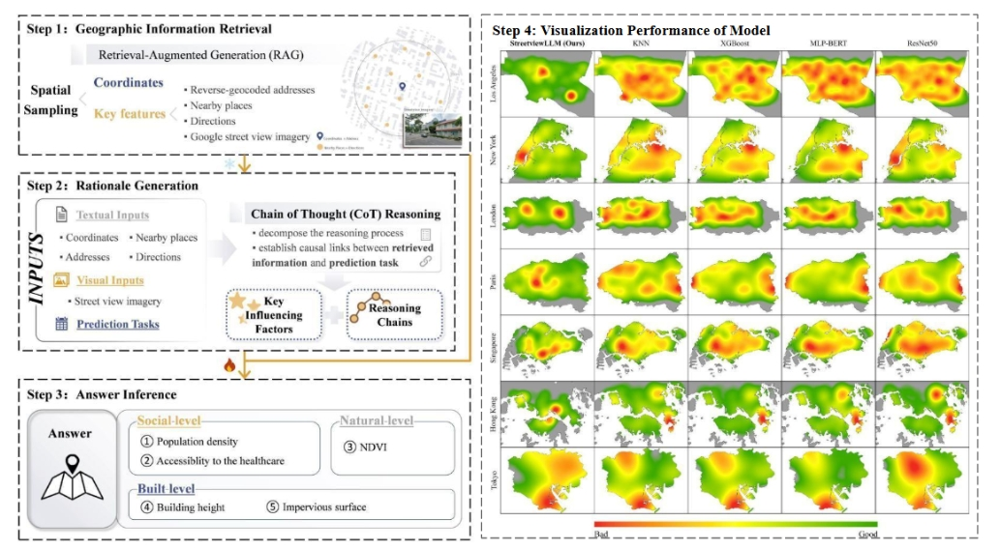

# StreetviewLLM



This is the official repository for "*StreetviewLLM: Extracting Geographic Information Using a Chain-of-Thought Multimodal Large Language Model*".


---

## Synopsis

**StreetViewLLM**  integrates large language models  with multimodal data to enhance geospatial predictions, leveraging street view imagery, geographic data, and retrieval-augmented generation. 
Tested in seven major cities, it outperforms traditional models in predicting urban indicators including population density, NDVI, and building height.

---

## About This Python Package

### Prerequisites
Before you start, install dependencies:  
```bash
pip install -r requirements.txt
```

APIs needed:
- [Google Street View API](https://developers.google.com/maps/documentation/streetview)
- [OpenAI API](https://platform.openai.com/docs/)


## License
*MIT License*  

